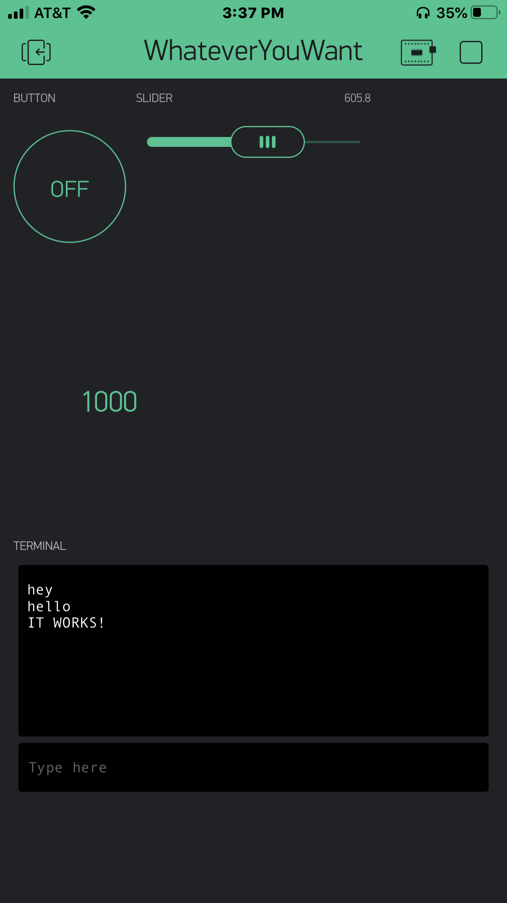

Name: Julian Wearden

EID: jfw864

Team Number: 11

## Questions

1. What is the purpose of an IP address?

    An IP address is a numerical label that helps identify nodes connected to a network. This allows data packets to go
where they need to go.

2. What is a DNS? What are the benefits of using domain names instead of IP addresses?

    DNS stands for a Domain Name Server which essentially translates names to IP addresses. It is beneficial to use over
IP addresses because it is easier for humans to use and remember names over a string of numbers.

3. What is the difference between a static IP and a dynamic IP?

    A static IP address is one that remains constant when connected to a network. A dynamic IP address changes on a device
and is assigned when connected. Dynamic IP addresses are usually better as they are more versatile and allow for a lower
chance of packet collision. 

4. What is the tradeoff between UDP and TCP protocols?

    UDP is a faster way of packet transfer than TCP. However, TCP establishes a handshake between sender and reciever 
before sending packets to ensure security and connection.

5. Why can't we use the delay function with Blynk?

    Because you couldn't interrupt the program halfway through a delay counter. If I were to press the button halfway
through a delay, I would have to wait for it to complete before it actually executed.

6. What does it mean for a function to be "Blocking"?

    A function is blocking when that function, and only that function, is able to run at a certain point. In other words
it blocks other code from running at that point in time.

7. Why are interrupts useful for writing Non-Blocking code?

    Interrupts are essentillly injected at any point throughout your code in a 2 dimensional fassion which allows your
code to be Non-Blocking. 

8. What is the difference between interface and implementation? Why is it important?

   An interface defines what an object can do, while implementation carries out the operation declared in the interface.
It's important because it seperates the actions from the "outline" of what can be done and is thus easier to manage the actions.

9. Screenshot of your Blynk App:

    
